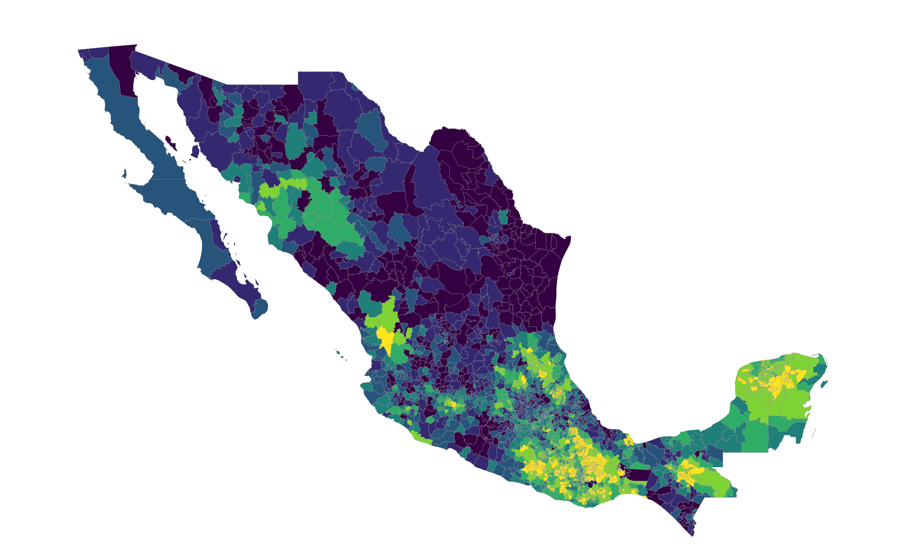

# ladata
<!-- badges: start -->

<!-- badges: end -->

This is an R package of datasets I've used to teach my Latin American politics course. The datasets are compiled from a bunch of different sources, and include data on topics such as: 

- Sale of colonial provincial offices in 17th-18th century Peru
- Varities of Democracy (V-DEM) indicators
- GDP, imports/exports, population, urbanization, etc.

I hope to keep this going!

